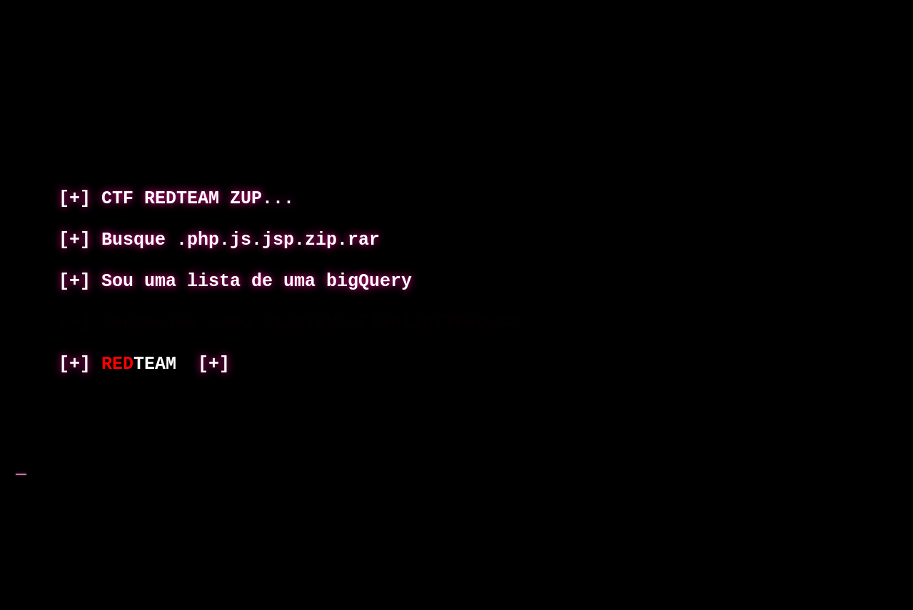

# Can you find me?

Desafio sem descrição.

## Assuntos relacionados ao desafio

- Encoding
- Enumeração de diretórios/arquivos

## Solução

Acessando o site no navegador, era mostrado a página inicial do site:



Acessando com "Ctrl+u" o código fonte da página, foi possível visualizar o texto
que estava com a cor bem próxima ao da cor de fundo:

```html
<font style="color:#ffffff;text-shadow:#FF0099 0px 0px 10px"> &nbsp;&nbsp;&nbsp;&nbsp;<b>[+] CTF REDTEAM ZUP...</b></font><b> <br>
<font style="color:#ffffff;text-shadow:#FF0099 0px 0px 10px"> &nbsp;&nbsp;&nbsp;&nbsp;<b>[+] Busque .php.js.jsp.zip.rar </b></font><b><br>
<font style="color:#ffffff;text-shadow:#FF0099 0px 0px 10px"> &nbsp;&nbsp;&nbsp;&nbsp;<b>[+] Sou uma lista de uma bigQuery </b></font><b><br>
<font style="color:#050000;text-shadow:#000000 0px 0px 10px"> &nbsp;&nbsp;&nbsp;&nbsp;<b>[+] Conhecida como V1ZoT2VscFlVblZpTTFKcw== </b></font><b><br>
<font style="color:#ffffff;text-shadow:#FF0099 0px 0px 10px"> &nbsp;&nbsp;&nbsp;&nbsp;<b>[+] <font style="color:red;text-shadow:#000 0px 0px 3px">RED</font><font style="color:white;text-shadow:#000 0px 0px 3px">TEAM</font>  [+]         </b></font><b> <br>
```

Quando um texto termina com 1 ou 2 caracteres de igual (=), provavelmente é
Base64, decodificando o texto algumas vezes a gente chega a palavra assetnote:

```
$ echo 'V1ZoT2VscFlVblZpTTFKcw==' | base64 -d
WVhOelpYUnViM1Js

$ echo 'V1ZoT2VscFlVblZpTTFKcw==' | base64 -d | base64 -d
YXNzZXRub3Rl

$ echo 'V1ZoT2VscFlVblZpTTFKcw==' | base64 -d | base64 -d | base64 -d
assetnote
```

Procurando por `assetnote`, cheguei ao site https://wordlists.assetnote.io que
disponibiliza algumas wordlists para download. No site do desafio fala "Sou uma
lista de uma bigQuery", procurando por "bigQuery" nos campos de busca do site da
Assetnote, na última tabela, é possível encontrar algumas wordlists. Baixando
apenas as wordlists das extensões do desafio e fazendo a enumeração de
diretórios e arquivos com elas, foi possível encontrar:

```
$ ffuf -u https://[redacted]/FUZZ -w ./jsp.txt


        /'___\  /'___\           /'___\       
       /\ \__/ /\ \__/  __  __  /\ \__/       
       \ \ ,__\\ \ ,__\/\ \/\ \ \ \ ,__\      
        \ \ \_/ \ \ \_/\ \ \_\ \ \ \ \_/      
         \ \_\   \ \_\  \ \____/  \ \_\       
          \/_/    \/_/   \/___/    \/_/       

       v1.5.0 Kali Exclusive <3
________________________________________________

 :: Method           : GET
 :: URL              : https://[redacted]/FUZZ
 :: Wordlist         : FUZZ: ./jsp.txt
 :: Follow redirects : false
 :: Calibration      : false
 :: Timeout          : 10
 :: Threads          : 40
 :: Matcher          : Response status: 200,204,301,302,307,401,403,405,500
________________________________________________

listPaymentObligationDocumentTypes.jsp [Status: 200, Size: 24, Words: 1, Lines: 2, Duration: 151ms]
:: Progress: [114894/114894] :: Job [1/1] :: 149 req/sec :: Duration: [0:13:07] :: Errors: 0 ::
```

Que ao acessar, revela a flag:

```
$ curl https://[redacted]/listPaymentObligationDocumentTypes.jsp

ZUP-CTF{JSP-RECON-9219}
```
